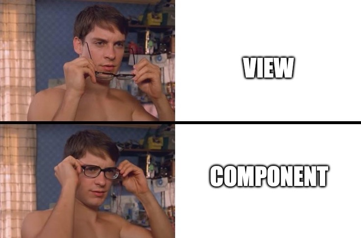

# Django Componentify

django-componentify is a powerful and user-friendly Django component library that simplifies the creation and management of reusable HTML components. With an intuitive API and flexible customization options, it empowers developers to build robust and modular web applications in Django.

## Features

- Easy integration: Seamlessly integrate HTML components into your Django projects.
- Reusability: Create reusable components to enhance code modularity and maintainability.
- Customization: Customize component styles and behavior to suit your project's needs.
- Extensibility: Extend the library with your own custom components and functionality.

## Contributing

Contributions are welcome! If you have any bug reports, feature requests, or would like to contribute code, please open an issue or submit a pull request.

## License

This project is licensed under the BSD 3-Clause License. See the [LICENSE](./LICENSE.md) file for more information.
